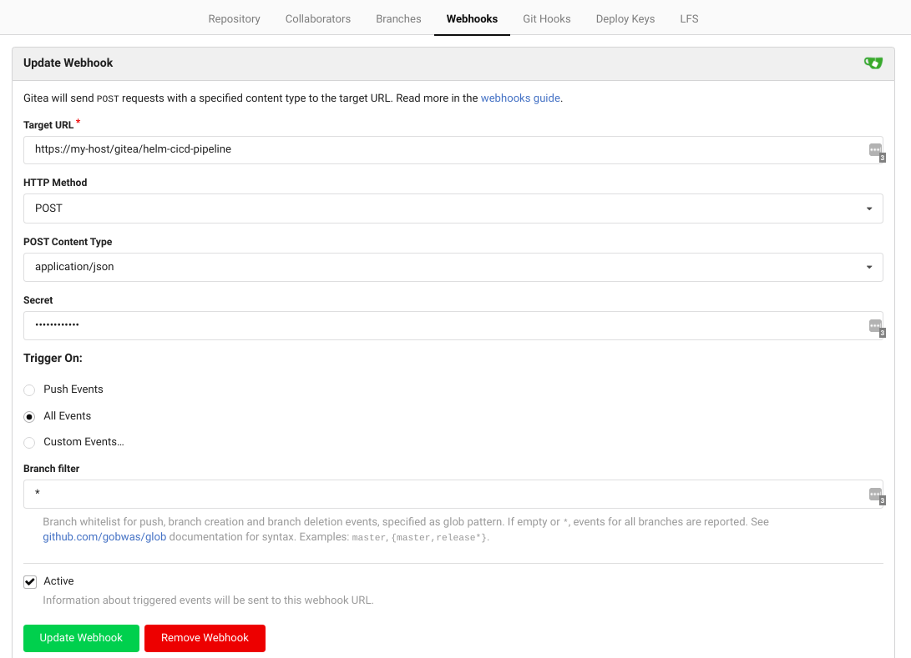

# Ingress Config and Webhooks

## Ingress Config

K8sci requires an ingress controller in order to work making a cluster ingress config mandatory. Fortunately ingress config follows the standard set by most helm charts. Here is an example ingress that uses the nginx controller with certificate manager to manage tls:

```yaml
ingress:
  host: cicd.mydomain.com
  dashboardHost: dashboard.cicd.mydomain.com
  dashboardURL: https://dashboard.cicd.mydomain.com
  annotations:
    kubernetes.io/ingress.class: nginx
    kubernetes.io/ingress.allow-http: "true"
    nginx.ingress.kubernetes.io/proxy-body-size: "0"
    nginx.ingress.kubernetes.io/proxy-read-timeout: "600"
    nginx.ingress.kubernetes.io/proxy-send-timeout: "600"
    nginx.ingress.kubernetes.io/force-ssl-redirect: "false"
    cert-manager.io/cluster-issuer: cert-issuer-letsencrypt-prod
  tls:
  - secretName: cicd-tls
    hosts:
      - cicd.keyporttech.com
  dashboardTLS:
  # Secrets must be manually created in the namespace.
  - secretName: dashboard-cicd-tls
    hosts:
      - dashboard.cicd.mydomain.com
```

The ingress controller is required because k8sci generates webhook endpoints based on the pipeline and git sources. Most clusters that host web applications will likely already have an ingress controller, but if not we recommend using the nginx ingress controller helm chart.

## Git Sources
In k8sci a git source is defined as a system that hosts git repositories such as github. Currently k8sci supports github and gitea. Tekton supports other git sources and the plan is to add more over time. The k8sci authors will make an effort to support self hosted git sources like gitea and gogs as first class citizens. To configure a git source in your values.yaml:

```yaml
gitSources:
  gitea: true
  github: true
```
This config would enable both the github and gitea endpoints. If support for a particular git source is not needed then set the value to false.

## Example generated webhook endpoints

K8sci exposes pipelines as webhook endpoints through the webhook ingress. Using the following pipelines definition:

```yaml
cicdPipelines:
  - name: nodejs
    image: node:12
    ciCommands:
      - execute: "make build"
        setStatus: "build"
    cdCommands:
      - execute: "make deploy"
        setStatus: "deploy"
  - name: golang
    image: golang:1.14
    ciCommands:
      - excute: "make build"
        setStatus: build
    cdCommands:
      - execute: "make deploy"
        setstatus: "deploy"
```

 Different uris are generated for github and gitea. The above pipeline and ingress config would generate the following:
  * https://host/gitea/golang
  * https://host/gitea/nodejs
  * https://host/github/golang
  * https://host/github/nodejs

K8s uses separate /gitea and /github endpoints as a logical separation of source traffic. Currently only github and gitea are supported, but other git hosting services could be easily added. (PRs would are appreciated).

## gitea and github webhook configuration

As an extra security precaution please set a webhookSecretToken in your helm values.yaml

```yaml
webhookSecretToken: MySecretToken
```
Let's say we have a pipeline named helm-cicd-pipeline.

In gitea configuring a web hook through the UI looks something like this:


In github configuring the webhook for the same pipeline looks like this:


# Exposing endpoints to github or the Internet
Please do not expose k8sci endpoints publicly unprotected.

In order for github to use k8sci endpoints they need to be exposed on the Internet. In addition to the webhook secret we strongly suggest limiting acecss to the known github webhook egress ips. Most cloud providers will have a solution for this: ex aws security groups. If not on a cloud most firewalls and or even home routers can do this as well.

The github ip ranges are [here](https://api.github.com/meta). At the time of this writing the github webhook ips rangers are:
```
"192.30.252.0/22",
"185.199.108.0/22",
"140.82.112.0/20"
```
